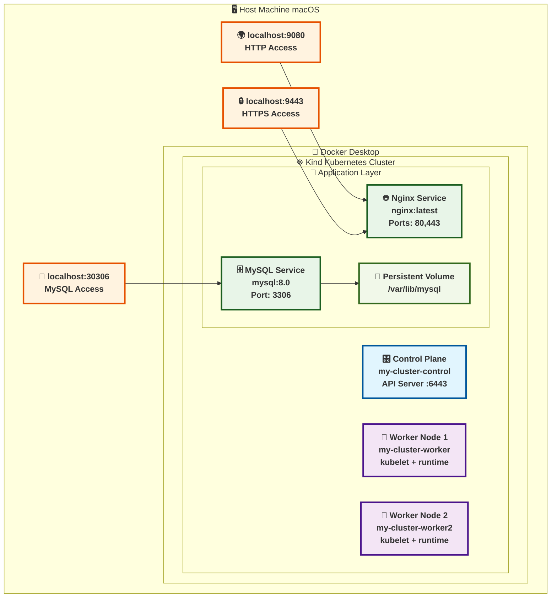
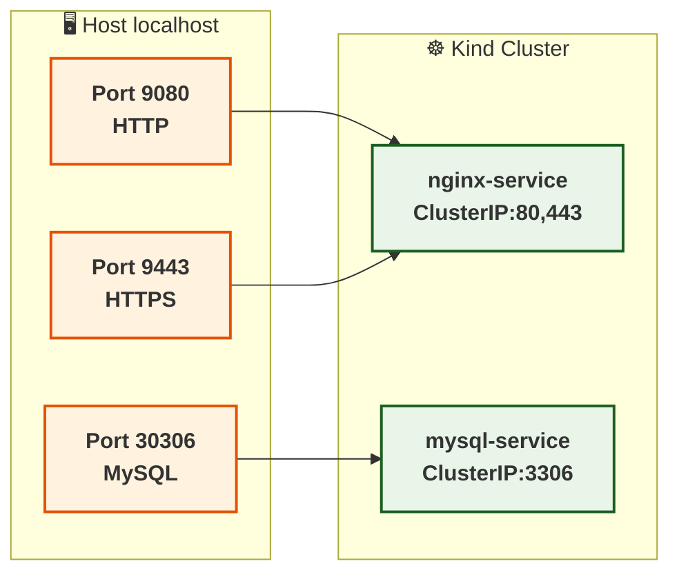
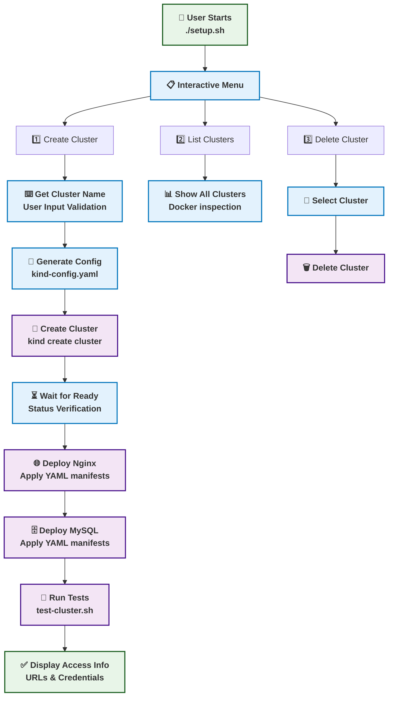
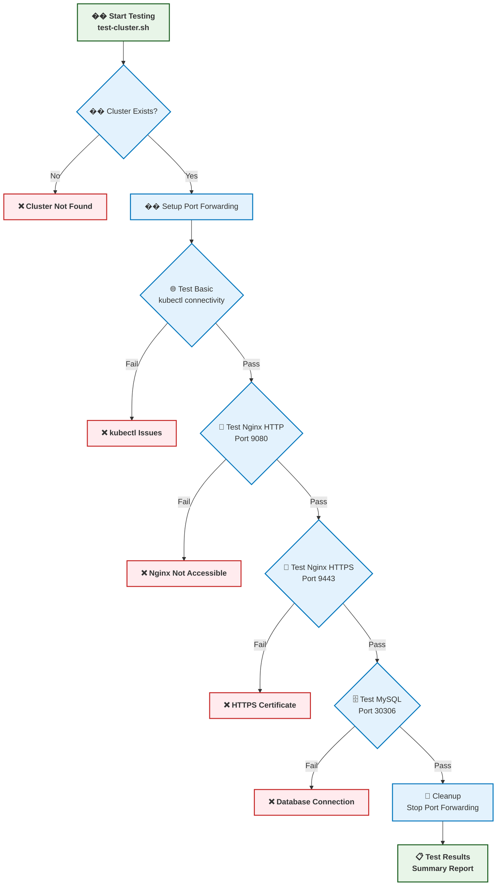
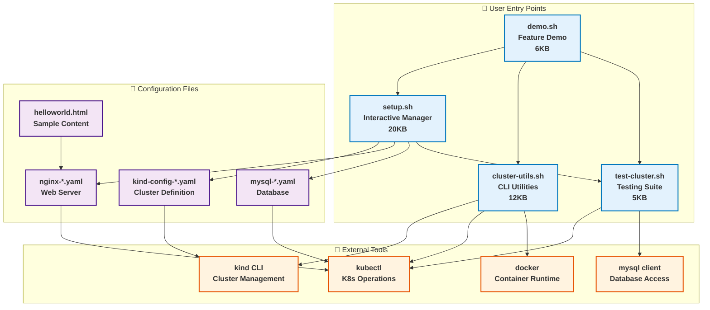
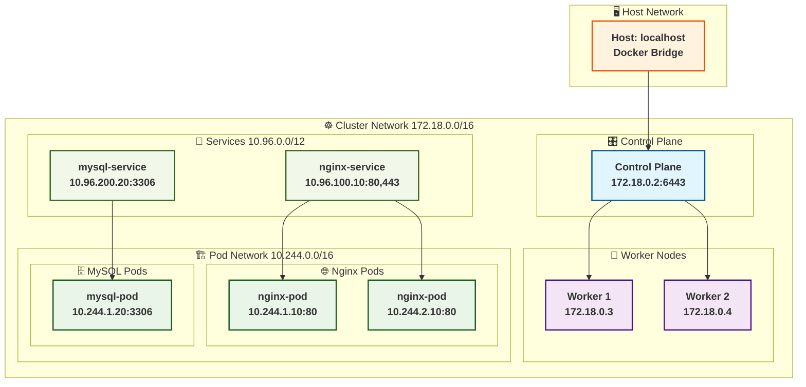
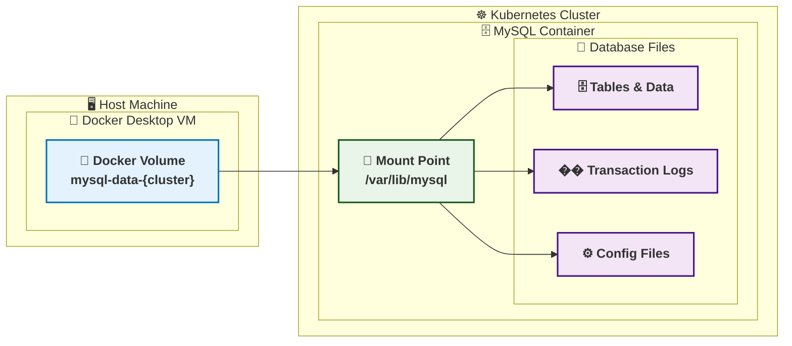
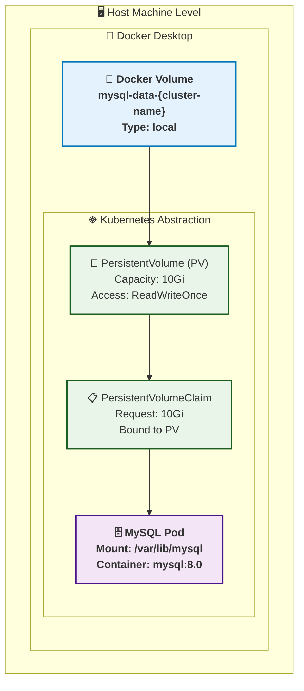
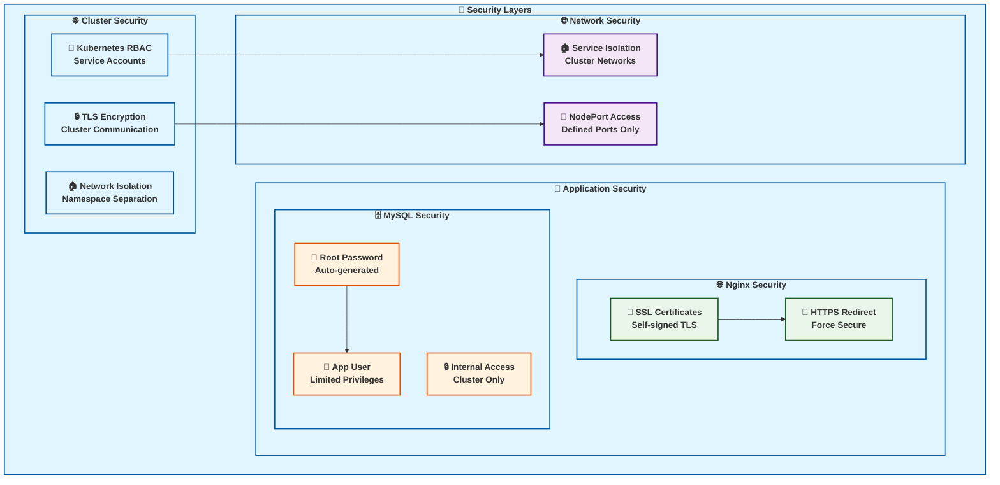

# 🏗️ Kind Kubernetes Cluster Manager - Architecture Documentation

This document provides comprehensive architecture diagrams using Mermaid to visualize the complete Kubernetes cluster system.

## 📋 Table of Contents

- [System Architecture](#system-architecture)
- [Workflow Diagrams](#workflow-diagrams)
- [Script Interactions](#script-interactions)  
- [Network Architecture](#network-architecture)
- [Data Flow](#data-flow)
- [Storage Architecture](#storage-architecture)
- [Security Model](#security-model)

## 🏗️ System Architecture

### High-Level Overview

### Port Mapping Architecture

## 📊 Workflow Diagrams

### 1. Cluster Creation Workflow

### 2. Testing Workflow

## 🔧 Script Interactions

### Script Dependency Graph

## 🌐 Network Architecture

### Internal Kubernetes Networking

## 💾 Data Flow

### MySQL Data Persistence

## 💽 Storage Architecture

### Persistent Volume Architecture

## 🔒 Security Model

### Security Architecture

### Access Control Matrix

| **Component** | **Internal Access** | **External Access** | **Security** |
|---------------|-------------------|-------------------|--------------|
| **🌐 Nginx Web Server** | `nginx-service:80,443` | `localhost:9080,9443` | `HTTP/HTTPS, SSL/TLS` |
| **🗄️ MySQL Database** | `mysql-service:3306` | `localhost:30306` | `User Auth, SSL/TLS` |
| **☸️ Kubernetes API** | `internal cluster API` | `kubectl via context` | `RBAC, TLS` |
| **🛠️ Management Scripts** | `Docker socket` | `Host shell access` | `File permissions` |

---

## 📊 Summary

This architecture documentation provides a comprehensive view of the Kind Kubernetes cluster management system, featuring:

- **🏗️ Complete Infrastructure**: 1 control plane + 2 workers with persistent storage
- **🚀 Production Applications**: Nginx web server + MySQL database with SSL/TLS
- **🛠️ Management Tools**: Interactive scripts and command-line utilities
- **🔒 Security**: Multi-layer security with proper authentication and encryption
- **📊 Monitoring**: Comprehensive testing and status reporting
- **💾 Data Persistence**: Survives cluster restarts and provides recovery options

**Perfect for development, testing, and learning Kubernetes in a local environment!** 🌟
