# 🏗️ Kind Kubernetes Cluster Manager - Architecture Documentation

## 📋 Table of Contents

- [System Architecture](#system-architecture)
- [Component Architecture](#component-architecture)
- [Workflow Diagrams](#workflow-diagrams)
- [Script Interactions](#script-interactions)
- [Network Architecture](#network-architecture)
- [Data Flow](#data-flow)
- [Storage Architecture](#storage-architecture)
- [Security Model](#security-model)

## 🏗️ System Architecture

### High-Level Overview

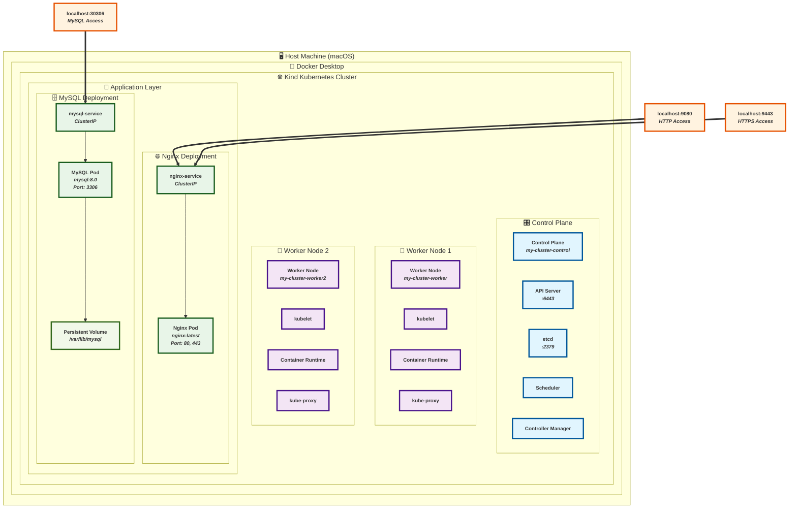

### Port Mapping Architecture

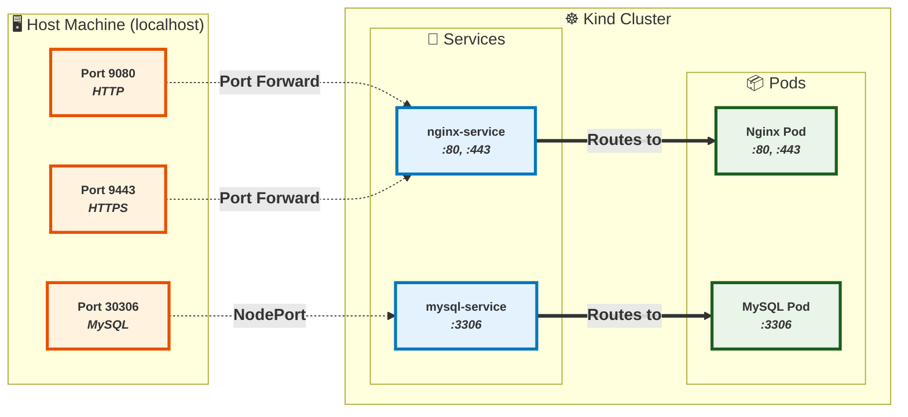

## 🔧 Component Architecture

### Script Component Hierarchy

```
Project Root
├── setup.sh              (Interactive Cluster Manager)
│   ├── create_cluster()  ──→ Uses kind-config-{name}.yaml
│   ├── deploy_apps()     ──→ Uses nginx-*.yaml, mysql-*.yaml
│   ├── test_cluster()    ──→ Calls test-cluster.sh
│   └── cleanup()         ──→ Calls kind delete
│
├── cluster-utils.sh       (Command-line Utilities)
│   ├── list_clusters()   ──→ Docker container inspection
│   ├── start_cluster()   ──→ docker start containers
│   ├── stop_cluster()    ──→ docker stop containers
│   ├── status()          ──→ kubectl + docker status
│   ├── logs()            ──→ kubectl logs aggregation
│   └── backup()          ──→ MySQL dump + config backup
│
├── test-cluster.sh        (Testing & Validation)
│   ├── test_basics()     ──→ kubectl connectivity
│   ├── test_nginx()      ──→ HTTP/HTTPS endpoint testing
│   ├── test_mysql()      ──→ Database connectivity
│   └── port_forward()    ──→ Service exposure
│
└── demo.sh               (Feature Demonstration)
    ├── demo_cluster()    ──→ Complete workflow demo
    ├── demo_features()   ──→ Feature showcase
    └── interactive_tour() ──→ Guided walkthrough
```

## 📊 Workflow Diagrams

### 1. Cluster Creation Workflow

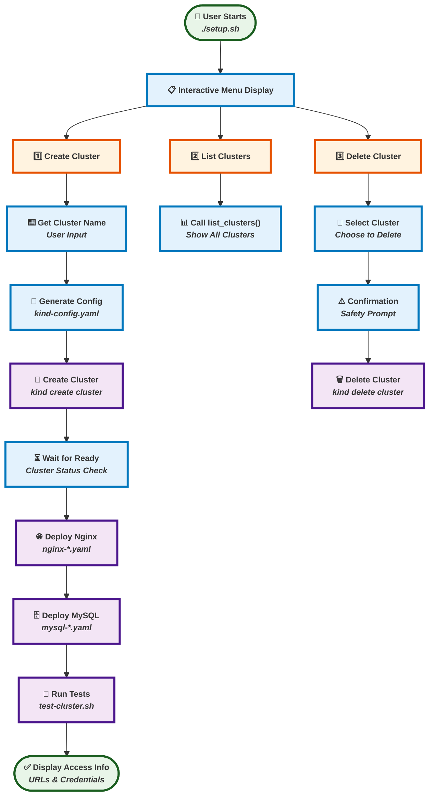

### 2. Testing Workflow

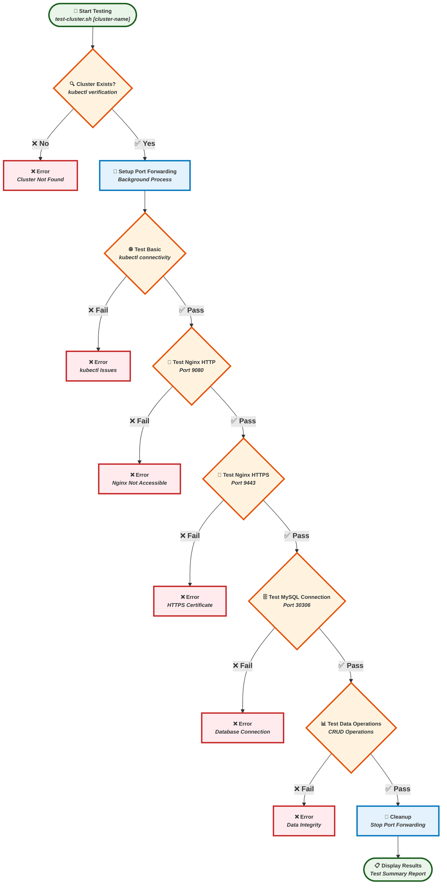

### 3. Cluster State Management

```
┌─────────────────┐
│ cluster-utils.sh│
│ status <name>   │
└─────────┬───────┘
          │
          ▼
┌─────────────────┐
│ Check Docker    │
│ Containers      │
│ (Label Filter)  │
└─────────┬───────┘
          │
          ▼
┌─────────────────┐
│ Count Running   │
│ vs Total        │
│ Containers      │
└─────────┬───────┘
          │
          ▼
┌─────────────────┐    ┌─────────────────┐    ┌─────────────────┐
│ All Running?    │    │ Some Running?   │    │ None Running?   │
│ Status: Running │    │ Status: Partial │    │ Status: Stopped │
└─────────────────┘    └─────────────────┘    └─────────┬───────┘
                                                        │
                                                        ▼
                                              ┌─────────────────┐
                                              │ No Containers?  │
                                              │ Status: Missing │
                                              └─────────────────┘
```

### 4. Start/Stop Operations

```
STOP CLUSTER:
┌─────────────────┐
│ cluster-utils.sh│
│ stop <name>     │
└─────────┬───────┘
          │
          ▼
┌─────────────────┐
│ Get Container   │
│ Names by Label  │
└─────────┬───────┘
          │
          ▼
┌─────────────────┐
│ docker stop     │
│ <containers>    │
└─────────┬───────┘
          │
          ▼
┌─────────────────┐
│ Verify Stopped  │
│ Status          │
└─────────────────┘

START CLUSTER:
┌─────────────────┐
│ cluster-utils.sh│
│ start <name>    │
└─────────┬───────┘
          │
          ▼
┌─────────────────┐
│ Get Container   │
│ Names by Label  │
└─────────┬───────┘
          │
          ▼
┌─────────────────┐
│ docker start    │
│ <containers>    │
└─────────┬───────┘
          │
          ▼
┌─────────────────┐
│ Wait for        │
│ Ready State     │
└─────────┬───────┘
          │
          ▼
┌─────────────────┐
│ Verify Running  │
│ Status          │
└─────────────────┘
```

## 🔗 Script Interactions

### Dependency Graph

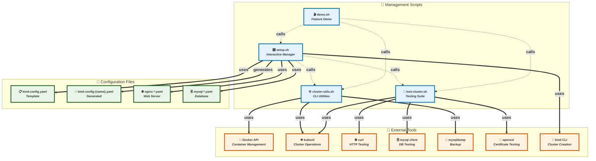

### Data Exchange

```
setup.sh ─────────── CLUSTER_NAME ──────────→ test-cluster.sh
    │                                              │
    │                                              ▼
    ├─────── Generated Config Files ─────→ kind create cluster
    │                                              │
    ▼                                              ▼
cluster-utils.sh ←──── Docker Containers ────── Kind Runtime
    │                                              │
    │                                              ▼
    └─────── Container States ──────────→ Status Reporting
```

## 🌐 Network Architecture

### Internal Cluster Networking

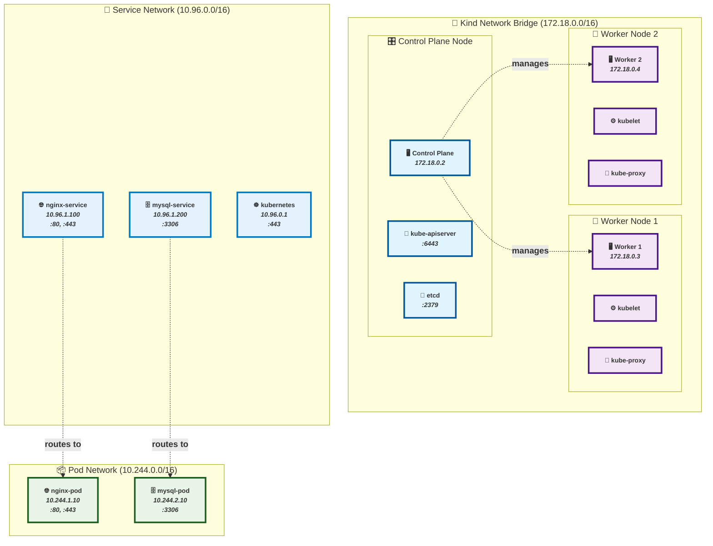

### External Access Pattern

```
Internet/Host
      │
      ▼
┌─────────────────┐
│ Host Machine    │
│ localhost       │
└─────────┬───────┘
          │
          ▼
┌─────────────────┐
│ Docker Desktop  │
│ Port Mapping    │
└─────────┬───────┘
          │
          ▼
┌─────────────────┐
│ Kind Cluster    │
│ Node Ports      │
└─────────┬───────┘
          │
          ▼
┌─────────────────┐
│ Kubernetes      │
│ Services        │
└─────────┬───────┘
          │
          ▼
┌─────────────────┐
│ Application     │
│ Pods            │
└─────────────────┘
```

## 💾 Data Flow

### MySQL Data Persistence

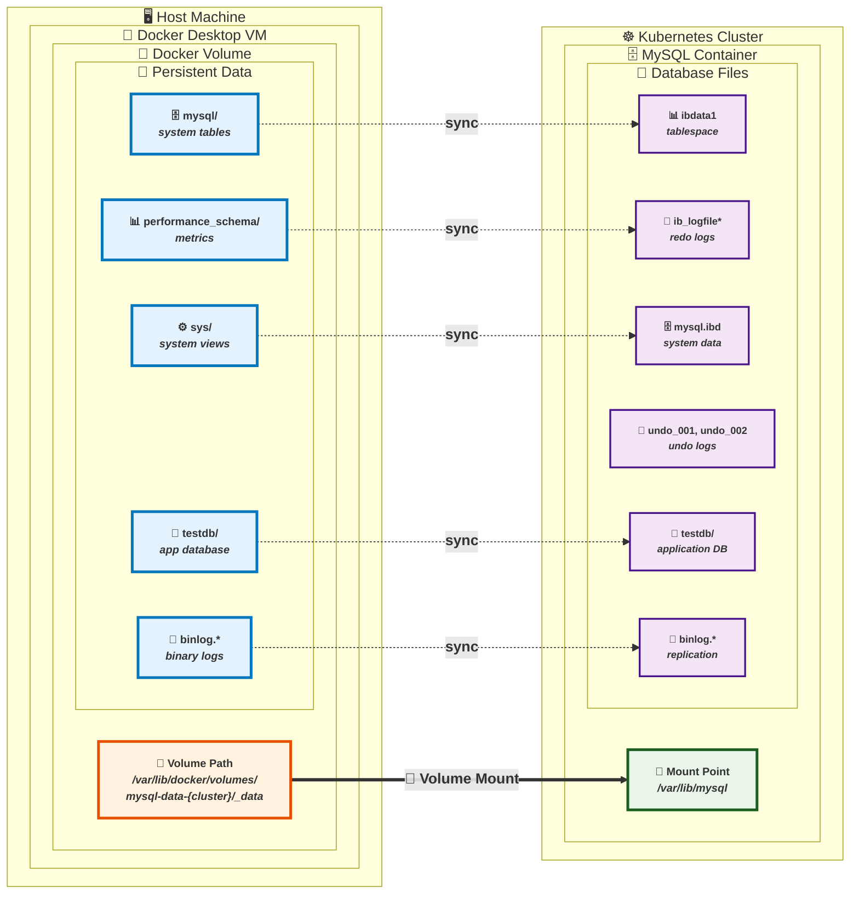

### Configuration Data Flow

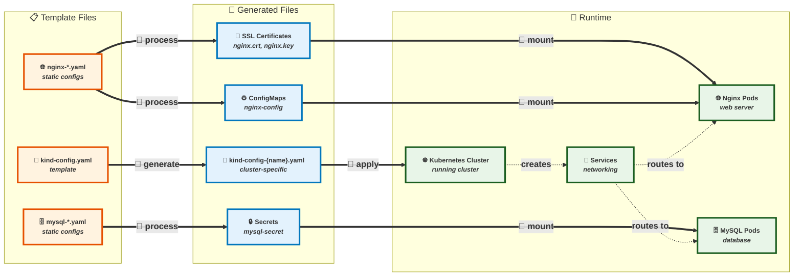

## 💽 Storage Architecture

### Persistent Volume Architecture

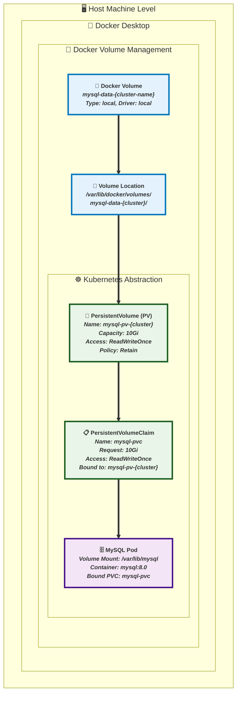

### Data Lifecycle Flow

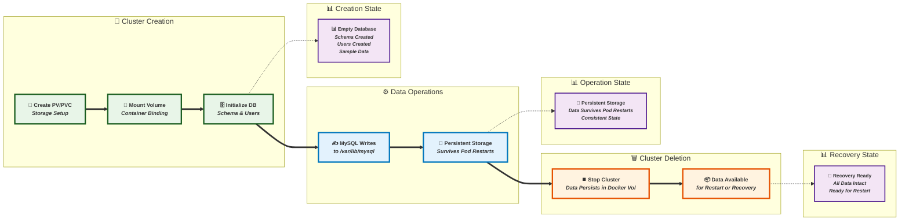

## 🔒 Security Model

### Security Architecture

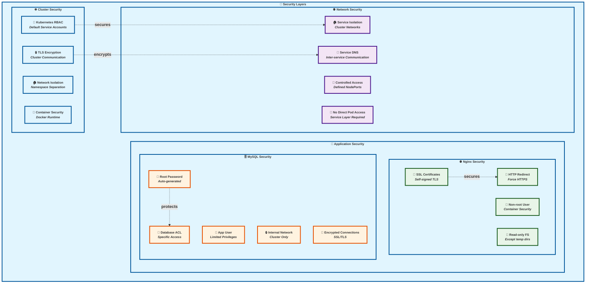

### Access Control Matrix

| **Component** | **Internal Access** | **External Access** | **Security** |
|---------------|-------------------|-------------------|--------------|
| **🌐 Nginx Web Server** | `nginx-service:80,443` | `localhost:9080,9443` | `HTTP/HTTPS, SSL/TLS` |
| **🗄️ MySQL Database** | `mysql-service:3306` | `localhost:30306` | `User Auth, SSL/TLS` |
| **☸️ Kubernetes API** | `internal cluster API` | `kubectl via context` | `RBAC, TLS` |
| **🛠️ Management Scripts** | `Docker socket` | `Host shell access` | `File permissions` |

### Certificate Management Workflow

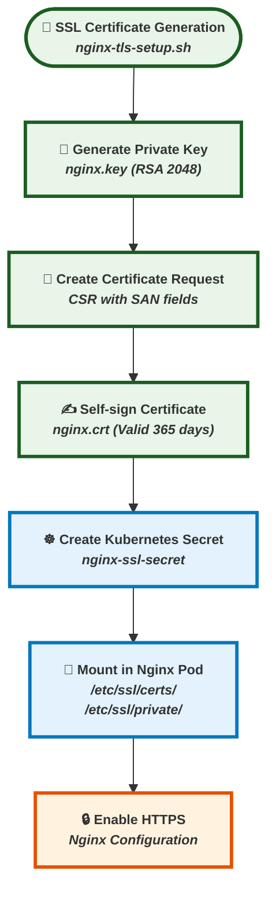

---

## 🔧 Implementation Details

### Container Resource Allocation

| **Component** | **CPU Limit** | **Memory Limit** | **Purpose** |
|---------------|---------------|------------------|-------------|
| **🎛️ Control Plane** | `200m` | `512Mi` | `Cluster Management` |
| **🔧 Worker Node 1** | `100m` | `512Mi` | `Application Hosting` |
| **🔧 Worker Node 2** | `100m` | `512Mi` | `Application Hosting` |
| **🌐 Nginx Pod** | `50m` | `64Mi` | `Web Server` |
| **🗄️ MySQL Pod** | `200m` | `512Mi` | `Database Server` |

### Performance Characteristics

- **🚀 Startup Time**: ~60-90 seconds for full cluster + applications
- **💾 Storage**: Persistent MySQL data survives cluster restarts
- **🔄 Scaling**: Supports multiple named clusters simultaneously
- **🧪 Testing**: Comprehensive health checks with detailed diagnostics
- **🔧 Management**: Full lifecycle management (create, start, stop, delete)

---

## 📊 Summary

This architecture documentation provides a comprehensive view of the Kind Kubernetes cluster management system, featuring:

- **🏗️ Complete Infrastructure**: 1 control plane + 2 workers with persistent storage
- **🚀 Production Applications**: Nginx web server + MySQL database with SSL/TLS
- **🛠️ Management Tools**: Interactive scripts and command-line utilities
- **🔒 Security**: Multi-layer security with proper authentication and encryption
- **📊 Monitoring**: Comprehensive testing and status reporting
- **💾 Data Persistence**: Survives cluster restarts and provides recovery options

**Perfect for development, testing, and learning Kubernetes in a local environment!** 🌟
