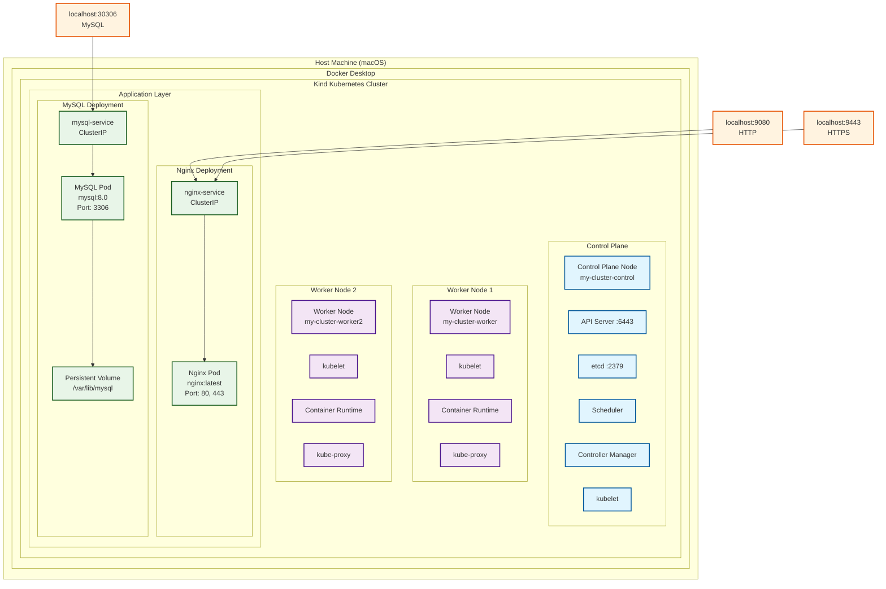
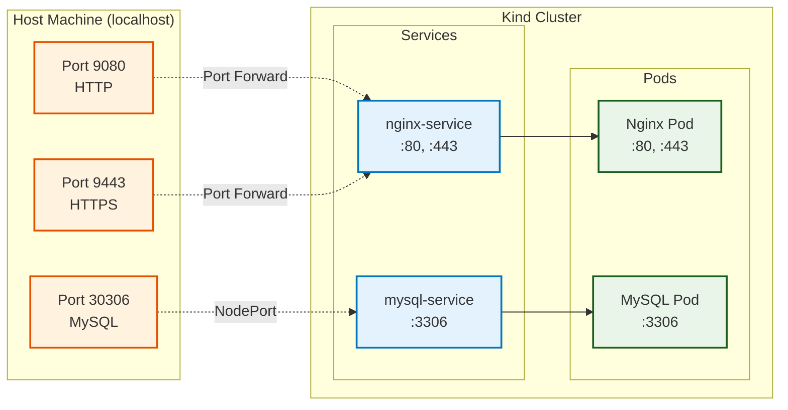
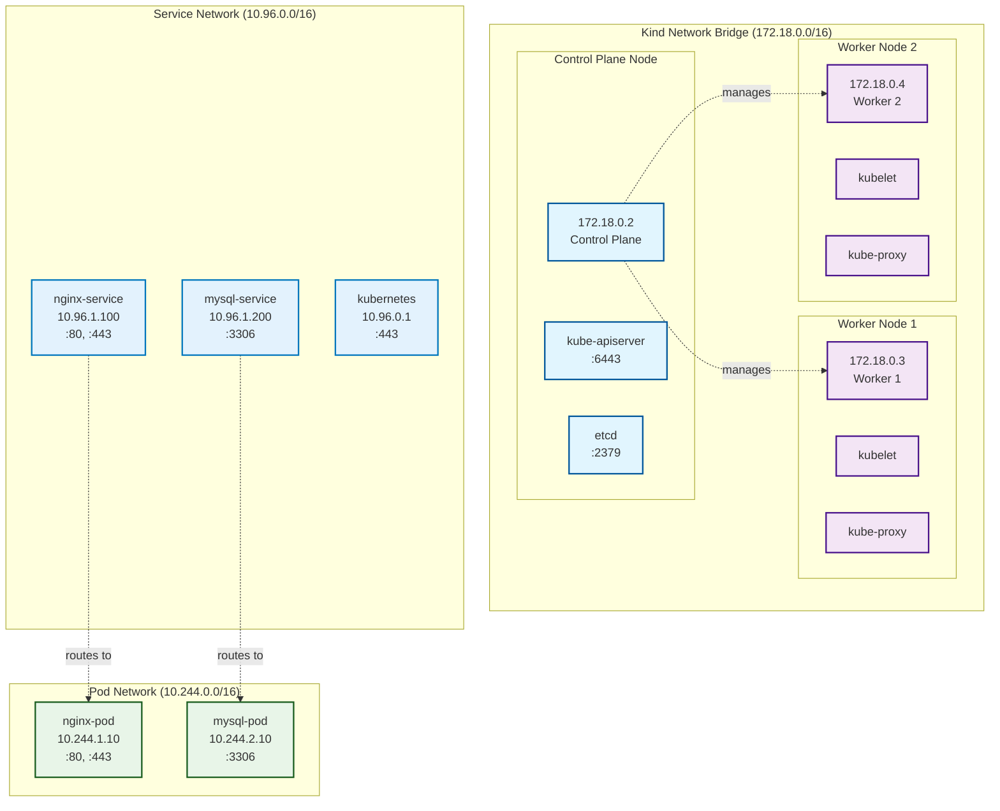
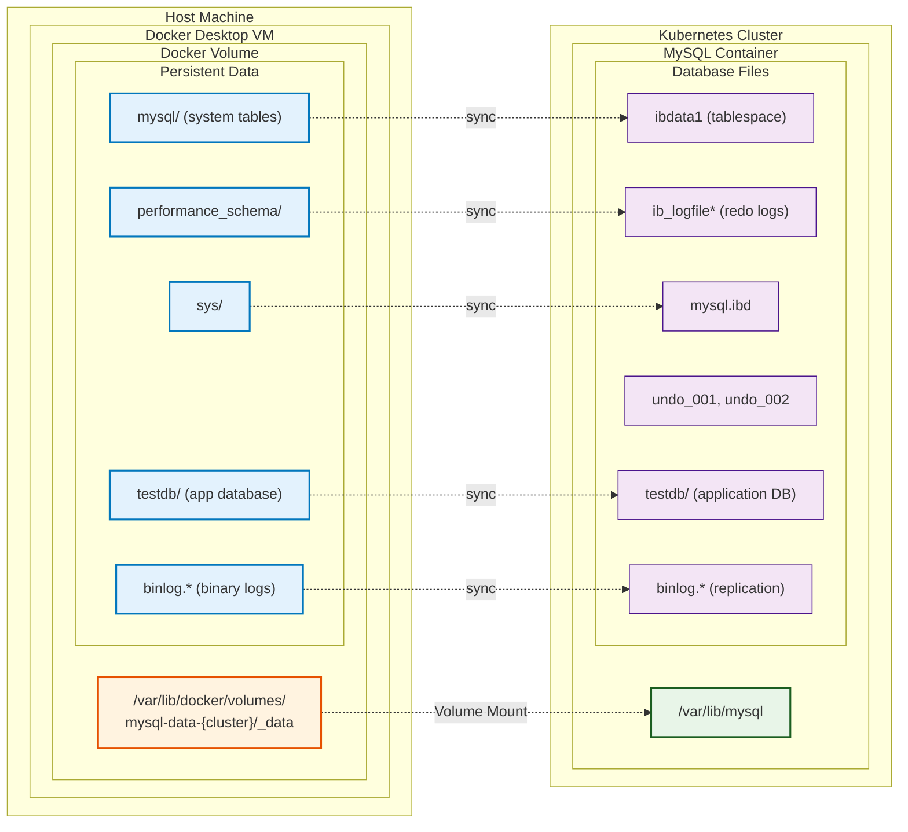

# 🏗️ Kind Kubernetes Cluster Manager - Architecture Documentation

## 📋 Table of Contents

- [System Architecture](#system-architecture)
- [Component Architecture](#component-architecture)
- [Workflow Diagrams](#workflow-diagrams)
- [Script Interactions](#script-interactions)
- [Network Architecture](#network-architecture)
- [Data Flow](#data-flow)
- [Storage Architecture](#storage-architecture)
- [Security Model](#security-model)

## 🏗️ System Architecture

### High-Level Overview



### Port Mapping Architecture



## 🔧 Component Architecture

### Script Component Hierarchy

```
Project Root
├── setup.sh              (Interactive Cluster Manager)
│   ├── create_cluster()  ──→ Uses kind-config-{name}.yaml
│   ├── deploy_apps()     ──→ Uses nginx-*.yaml, mysql-*.yaml
│   ├── test_cluster()    ──→ Calls test-cluster.sh
│   └── cleanup()         ──→ Calls kind delete
│
├── cluster-utils.sh       (Command-line Utilities)
│   ├── list_clusters()   ──→ Docker container inspection
│   ├── start_cluster()   ──→ docker start containers
│   ├── stop_cluster()    ──→ docker stop containers
│   ├── status()          ──→ kubectl + docker status
│   ├── logs()            ──→ kubectl logs aggregation
│   └── backup()          ──→ MySQL dump + config backup
│
├── test-cluster.sh        (Testing & Validation)
│   ├── test_basics()     ──→ kubectl connectivity
│   ├── test_nginx()      ──→ HTTP/HTTPS endpoint testing
│   ├── test_mysql()      ──→ Database connectivity
│   └── port_forward()    ──→ Service exposure
│
└── demo.sh               (Feature Demonstration)
    ├── demo_cluster()    ──→ Complete workflow demo
    ├── demo_features()   ──→ Feature showcase
    └── interactive_tour() ──→ Guided walkthrough
```

## 📊 Workflow Diagrams

### 1. Cluster Creation Workflow

```mermaid
flowchart TD
    START([User Starts<br/>./setup.sh]) --> MENU[Interactive Menu Display]
    
    MENU --> OPT1[Option 1: Create Cluster]
    MENU --> OPT2[Option 2: List Clusters]
    MENU --> OPT3[Option 3: Delete Cluster]
    
    %% Create Cluster Path
    OPT1 --> INPUT[Get Cluster Name<br/>Input]
    INPUT --> GENERATE[Generate<br/>kind-config.yaml]
    GENERATE --> CREATE[kind create cluster]
    CREATE --> WAIT[Wait for Cluster Ready]
    WAIT --> NGINX[Deploy Nginx<br/>nginx-*.yaml]
    NGINX --> MYSQL[Deploy MySQL<br/>mysql-*.yaml]
    MYSQL --> TEST[Run Tests<br/>test-cluster.sh]
    TEST --> ACCESS[Display Access Information]
    
    %% List Clusters Path
    OPT2 --> LIST[Call list_clusters()]
    
    %% Delete Cluster Path
    OPT3 --> SELECT[Select Cluster to Delete]
    SELECT --> CONFIRM[Confirmation Prompt]
    CONFIRM --> DELETE[kind delete cluster]
    
    %% Styling
    classDef startEnd fill:#e8f5e8,stroke:#1b5e20,stroke-width:2px
    classDef process fill:#e3f2fd,stroke:#0277bd,stroke-width:2px
    classDef decision fill:#fff3e0,stroke:#e65100,stroke-width:2px
    classDef action fill:#f3e5f5,stroke:#4a148c,stroke-width:2px
    
    class START,ACCESS startEnd
    class MENU,INPUT,GENERATE,WAIT,LIST,SELECT,CONFIRM process
    class OPT1,OPT2,OPT3 decision
    class CREATE,NGINX,MYSQL,TEST,DELETE action
```

### 2. Testing Workflow

```mermaid
flowchart TD
    START([test-cluster.sh<br/>[cluster-name]]) --> CHECK{Cluster Exists?<br/>kubectl}
    
    CHECK -->|❌| ERROR1[Error: Cluster<br/>Not Found]
    CHECK -->|✅| SETUP[Setup Port<br/>Forwarding<br/>Background]
    
    SETUP --> TEST1{Test Basic<br/>Connectivity}
    TEST1 -->|❌| ERROR2[Error: kubectl<br/>Issues]
    TEST1 -->|✅| TEST2{Test Nginx<br/>HTTP Endpoint}
    
    TEST2 -->|❌| ERROR3[Error: Nginx<br/>Not Accessible]
    TEST2 -->|✅| TEST3{Test Nginx<br/>HTTPS Endpoint}
    
    TEST3 -->|❌| ERROR4[Error: HTTPS<br/>Certificate]
    TEST3 -->|✅| TEST4{Test MySQL<br/>Connection}
    
    TEST4 -->|❌| ERROR5[Error: Database<br/>Connection]
    TEST4 -->|✅| TEST5{Test Data<br/>Operations}
    
    TEST5 -->|❌| ERROR6[Error: Data<br/>Integrity]
    TEST5 -->|✅| CLEANUP[Cleanup Port<br/>Forwarding]
    
    CLEANUP --> RESULTS([Display Test<br/>Results Summary])
    
    %% Styling
    classDef startEnd fill:#e8f5e8,stroke:#1b5e20,stroke-width:2px
    classDef process fill:#e3f2fd,stroke:#0277bd,stroke-width:2px
    classDef decision fill:#fff3e0,stroke:#e65100,stroke-width:2px
    classDef error fill:#ffebee,stroke:#c62828,stroke-width:2px
    
    class START,RESULTS startEnd
    class SETUP,CLEANUP process
    class CHECK,TEST1,TEST2,TEST3,TEST4,TEST5 decision
    class ERROR1,ERROR2,ERROR3,ERROR4,ERROR5,ERROR6 error
```

### 3. Cluster State Management

```
┌─────────────────┐
│ cluster-utils.sh│
│ status <name>   │
└─────────┬───────┘
          │
          ▼
┌─────────────────┐
│ Check Docker    │
│ Containers      │
│ (Label Filter)  │
└─────────┬───────┘
          │
          ▼
┌─────────────────┐
│ Count Running   │
│ vs Total        │
│ Containers      │
└─────────┬───────┘
          │
          ▼
┌─────────────────┐    ┌─────────────────┐    ┌─────────────────┐
│ All Running?    │    │ Some Running?   │    │ None Running?   │
│ Status: Running │    │ Status: Partial │    │ Status: Stopped │
└─────────────────┘    └─────────────────┘    └─────────┬───────┘
                                                        │
                                                        ▼
                                              ┌─────────────────┐
                                              │ No Containers?  │
                                              │ Status: Missing │
                                              └─────────────────┘
```

### 4. Start/Stop Operations

```
STOP CLUSTER:
┌─────────────────┐
│ cluster-utils.sh│
│ stop <name>     │
└─────────┬───────┘
          │
          ▼
┌─────────────────┐
│ Get Container   │
│ Names by Label  │
└─────────┬───────┘
          │
          ▼
┌─────────────────┐
│ docker stop     │
│ <containers>    │
└─────────┬───────┘
          │
          ▼
┌─────────────────┐
│ Verify Stopped  │
│ Status          │
└─────────────────┘

START CLUSTER:
┌─────────────────┐
│ cluster-utils.sh│
│ start <name>    │
└─────────┬───────┘
          │
          ▼
┌─────────────────┐
│ Get Container   │
│ Names by Label  │
└─────────┬───────┘
          │
          ▼
┌─────────────────┐
│ docker start    │
│ <containers>    │
└─────────┬───────┘
          │
          ▼
┌─────────────────┐
│ Wait for        │
│ Ready State     │
└─────────┬───────┘
          │
          ▼
┌─────────────────┐
│ Verify Running  │
│ Status          │
└─────────────────┘
```

## 🔗 Script Interactions

### Dependency Graph

```mermaid
graph TB
    subgraph "Scripts"
        SETUP[setup.sh<br/>Interactive Manager]
        UTILS[cluster-utils.sh<br/>CLI Utilities]
        TEST[test-cluster.sh<br/>Testing Suite]
        DEMO[demo.sh<br/>Feature Demo]
    end
    
    subgraph "Configuration Files"
        KIND_TEMPLATE[kind-config.yaml<br/>Template]
        KIND_GENERATED[kind-config-{name}.yaml<br/>Generated]
        NGINX_FILES[nginx-*.yaml<br/>Web Server]
        MYSQL_FILES[mysql-*.yaml<br/>Database]
    end
    
    subgraph "External Tools"
        DOCKER[Docker API<br/>Container Management]
        KUBECTL[kubectl<br/>Cluster Operations]
        CURL[curl<br/>HTTP Testing]
        MYSQL_CLIENT[mysql client<br/>DB Testing]
        MYSQLDUMP[mysqldump<br/>Backup]
        OPENSSL[openssl<br/>Certificate Testing]
        KIND_CLI[kind CLI<br/>Cluster Creation]
    end
    
    %% Script relationships
    SETUP -.->|calls| TEST
    SETUP -.->|calls| UTILS
    DEMO -.->|calls| SETUP
    DEMO -.->|calls| UTILS
    DEMO -.->|calls| TEST
    
    %% File dependencies
    SETUP -->|generates| KIND_GENERATED
    SETUP -->|uses| KIND_TEMPLATE
    SETUP -->|uses| NGINX_FILES
    SETUP -->|uses| MYSQL_FILES
    
    %% External tool usage
    SETUP -->|uses| KIND_CLI
    UTILS -->|uses| DOCKER
    UTILS -->|uses| KUBECTL
    UTILS -->|uses| MYSQLDUMP
    TEST -->|uses| KUBECTL
    TEST -->|uses| CURL
    TEST -->|uses| MYSQL_CLIENT
    TEST -->|uses| OPENSSL
    
    %% Styling
    classDef script fill:#e3f2fd,stroke:#0277bd,stroke-width:2px
    classDef config fill:#e8f5e8,stroke:#1b5e20,stroke-width:2px
    classDef external fill:#fff3e0,stroke:#e65100,stroke-width:2px
    
    class SETUP,UTILS,TEST,DEMO script
    class KIND_TEMPLATE,KIND_GENERATED,NGINX_FILES,MYSQL_FILES config
    class DOCKER,KUBECTL,CURL,MYSQL_CLIENT,MYSQLDUMP,OPENSSL,KIND_CLI external
```

### Data Exchange

```
setup.sh ─────────── CLUSTER_NAME ──────────→ test-cluster.sh
    │                                              │
    │                                              ▼
    ├─────── Generated Config Files ─────→ kind create cluster
    │                                              │
    ▼                                              ▼
cluster-utils.sh ←──── Docker Containers ────── Kind Runtime
    │                                              │
    │                                              ▼
    └─────── Container States ──────────→ Status Reporting
```

## 🌐 Network Architecture

### Internal Cluster Networking



### External Access Pattern

```
Internet/Host
      │
      ▼
┌─────────────────┐
│ Host Machine    │
│ localhost       │
└─────────┬───────┘
          │
          ▼
┌─────────────────┐
│ Docker Desktop  │
│ Port Mapping    │
└─────────┬───────┘
          │
          ▼
┌─────────────────┐
│ Kind Cluster    │
│ Node Ports      │
└─────────┬───────┘
          │
          ▼
┌─────────────────┐
│ Kubernetes      │
│ Services        │
└─────────┬───────┘
          │
          ▼
┌─────────────────┐
│ Application     │
│ Pods            │
└─────────────────┘
```

## 💾 Data Flow

### MySQL Data Persistence



### Configuration Data Flow

```mermaid
graph LR
    subgraph "Template Files"
        TEMPLATE[kind-config.yaml<br/>template]
        STATIC_NGINX[nginx-*.yaml<br/>static]
        STATIC_MYSQL[mysql-*.yaml<br/>static]
    end
    
    subgraph "Generated Files"
        GENERATED[kind-config-{name}.yaml<br/>cluster-specific]
        SSL_CERTS[SSL Certificates<br/>nginx.crt, nginx.key]
        CONFIG_MAPS[ConfigMaps<br/>nginx-config]
        SECRETS[Secrets<br/>mysql-secret]
    end
    
    subgraph "Runtime"
        K8S_CLUSTER[Kubernetes Cluster]
        NGINX_PODS[Nginx Pods]
        MYSQL_PODS[MySQL Pods]
        SERVICES[Services]
    end
    
    %% Template to Generated
    TEMPLATE -->|generate| GENERATED
    STATIC_NGINX -->|process| SSL_CERTS
    STATIC_NGINX -->|process| CONFIG_MAPS
    STATIC_MYSQL -->|process| SECRETS
    
    %% Generated to Runtime
    GENERATED -->|apply| K8S_CLUSTER
    SSL_CERTS -->|mount| NGINX_PODS
    CONFIG_MAPS -->|mount| NGINX_PODS
    SECRETS -->|mount| MYSQL_PODS
    
    %% Runtime connections
    K8S_CLUSTER -.-> SERVICES
    SERVICES -.-> NGINX_PODS
    SERVICES -.-> MYSQL_PODS
    
    %% Styling
    classDef template fill:#fff3e0,stroke:#e65100,stroke-width:2px
    classDef generated fill:#e3f2fd,stroke:#0277bd,stroke-width:2px
    classDef runtime fill:#e8f5e8,stroke:#1b5e20,stroke-width:2px
    
    class TEMPLATE,STATIC_NGINX,STATIC_MYSQL template
    class GENERATED,SSL_CERTS,CONFIG_MAPS,SECRETS generated
    class K8S_CLUSTER,NGINX_PODS,MYSQL_PODS,SERVICES runtime
```

## 💽 Storage Architecture

### Persistent Volume Architecture

```
┌─────────────────────────────────────────────────────────────────────────┐
│                              Host Machine                               │
├─────────────────────────────────────────────────────────────────────────┤
│                            Docker Desktop                               │
│                                                                         │
│  ┌─────────────────────────────────────────────────────────────────────┐ │
│  │                    Docker Volume Management                         │ │
│  │                                                                     │ │
│  │  Volume: mysql-data-{cluster-name}                                  │ │
│  │  Location: /var/lib/docker/volumes/mysql-data-{cluster}/           │ │
│  │  Type: local                                                        │ │
│  │  Driver: local                                                      │ │
│  │                                                                     │ │
│  │  ┌─────────────────────────────────────────────────────────────┐    │ │
│  │  │                Kubernetes Abstraction                       │    │ │
│  │  │                                                             │    │ │
│  │  │  PersistentVolume (PV)                                      │    │ │
│  │  │  ├── Name: mysql-pv-{cluster}                               │    │ │
│  │  │  ├── Capacity: 10Gi                                         │    │ │
│  │  │  ├── Access Mode: ReadWriteOnce                             │    │ │
│  │  │  ├── Reclaim Policy: Retain                                 │    │ │
│  │  │  └── Host Path: /mnt/data                                   │    │ │
│  │  │                                                             │    │ │
│  │  │  PersistentVolumeClaim (PVC)                                │    │ │
│  │  │  ├── Name: mysql-pvc                                        │    │ │
│  │  │  ├── Request: 10Gi                                          │    │ │
│  │  │  ├── Access Mode: ReadWriteOnce                             │    │ │
│  │  │  └── Bound to: mysql-pv-{cluster}                          │    │ │
│  │  │                                                             │    │ │
│  │  │  MySQL Pod                                                  │    │ │
│  │  │  ├── Volume Mount: /var/lib/mysql                           │    │ │
│  │  │  ├── Bound PVC: mysql-pvc                                   │    │ │
│  │  │  └── Container: mysql:8.0                                   │    │ │
│  │  └─────────────────────────────────────────────────────────────┘    │ │
│  └─────────────────────────────────────────────────────────────────────┘ │
└─────────────────────────────────────────────────────────────────────────┘
```

### Data Lifecycle

```
Cluster Creation                   Data Operations                  Cluster Deletion
┌─────────────────┐               ┌─────────────────┐               ┌─────────────────┐
│ Create PV/PVC   │               │ MySQL Writes    │               │ Stop Cluster    │
│ Mount Volume    │ ────────────→ │ to /var/lib/    │ ────────────→ │ (Data Persists) │
│ Initialize DB   │               │ mysql           │               │ in Docker Vol   │
└─────────────────┘               └─────────────────┘               └─────────────────┘
         │                                 │                                │
         ▼                                 ▼                                ▼
┌─────────────────┐               ┌─────────────────┐               ┌─────────────────┐
│ Empty Database  │               │ Persistent      │               │ Data Available  │
│ Schema Created  │               │ Storage         │               │ for Restart     │
│ Users Created   │               │ (Survives Pod   │               │ or Recovery     │
│ Sample Data     │               │ Restarts)       │               │                 │
└─────────────────┘               └─────────────────┘               └─────────────────┘
```

## 🔒 Security Model

### Authentication & Authorization

```
┌─────────────────────────────────────────────────────────────────────────┐
│                            Security Layers                              │
├─────────────────────────────────────────────────────────────────────────┤
│                                                                         │
│  ┌─────────────────────────────────────────────────────────────────────┐ │
│  │                        Cluster Security                            │ │
│  │                                                                     │ │
│  │  • Kubernetes RBAC (default service accounts)                      │ │
│  │  • TLS encryption for cluster communication                        │ │
│  │  • Isolated network namespaces                                     │ │
│  │  • Container runtime security (Docker)                             │ │
│  └─────────────────────────────────────────────────────────────────────┘ │
│                                                                         │
│  ┌─────────────────────────────────────────────────────────────────────┐ │
│  │                      Application Security                           │ │
│  │                                                                     │ │
│  │  Nginx (Web Server):                                               │ │
│  │  ├── Self-signed SSL certificates                                  │ │
│  │  ├── HTTP redirect to HTTPS                                        │ │
│  │  ├── Non-root container user                                       │ │
│  │  └── Read-only filesystem (except temp dirs)                       │ │
│  │                                                                     │ │
│  │  MySQL (Database):                                                 │ │
│  │  ├── Root password (auto-generated)                                │ │
│  │  ├── Application user with limited privileges                      │ │
│  │  ├── Database-specific access controls                             │ │
│  │  ├── Internal cluster networking only                              │ │
│  │  └── Encrypted connections (SSL/TLS)                               │ │
│  └─────────────────────────────────────────────────────────────────────┘ │
│                                                                         │
│  ┌─────────────────────────────────────────────────────────────────────┐ │
│  │                        Network Security                             │ │
│  │                                                                     │ │
│  │  • Services isolated within cluster network                        │ │
│  │  • External access only through defined NodePorts                  │ │
│  │  • No direct pod-to-host communication                             │ │
│  │  • Inter-service communication via service DNS                     │ │
│  └─────────────────────────────────────────────────────────────────────┘ │
└─────────────────────────────────────────────────────────────────────────┘
```

### Certificate Management

```
SSL Certificate Generation (nginx-tls-setup.sh):
┌─────────────────┐
│ Generate        │
│ Private Key     │
│ (nginx.key)     │
└─────────┬───────┘
          │
          ▼
┌─────────────────┐
│ Create          │
│ Certificate     │
│ Request (CSR)   │
└─────────┬───────┘
          │
          ▼
┌─────────────────┐
│ Self-sign       │
│ Certificate     │
│ (nginx.crt)     │
└─────────┬───────┘
          │
          ▼
┌─────────────────┐
│ Create          │
│ Kubernetes      │
│ Secret          │
└─────────┬───────┘
          │
          ▼
┌─────────────────┐
│ Mount in        │
│ Nginx Pod       │
│ (/etc/ssl/)     │
└─────────────────┘
```

### Access Control Matrix

```
Component      │ Internal Access        │ External Access       │ Security
─────────────────────────────────────────────────────────────────────────
Nginx Web      │ Service: nginx-service │ Host: localhost:9080  │ HTTP/HTTPS
Server         │ Port: 80, 443         │      localhost:9443  │ SSL/TLS
─────────────────────────────────────────────────────────────────────────
MySQL          │ Service: mysql-service │ Host: localhost:30306 │ User Auth
Database       │ Port: 3306            │                       │ SSL/TLS
─────────────────────────────────────────────────────────────────────────
Kubernetes     │ Internal cluster API   │ kubectl via context   │ RBAC
API            │ service discovery     │ admin credentials     │ TLS
─────────────────────────────────────────────────────────────────────────
Management     │ Docker socket         │ Host shell access     │ File perms
Scripts        │ kubectl config        │ script execution      │ User context
```

---

## 🔧 Implementation Details

### Container Resource Allocation

```
Resource Limits per Component:
┌─────────────────┐  ┌─────────────────┐  ┌─────────────────┐
│ Control Plane   │  │   Worker 1      │  │   Worker 2      │
│                 │  │                 │  │                 │
│ CPU: 100m       │  │ CPU: 100m       │  │ CPU: 100m       │
│ Memory: 512Mi   │  │ Memory: 512Mi   │  │ Memory: 512Mi   │
│                 │  │                 │  │                 │
│ ┌─────────────┐ │  │ ┌─────────────┐ │  │ ┌─────────────┐ │
│ │ System Pods │ │  │ │ Nginx Pod   │ │  │ │ MySQL Pod   │ │
│ │             │ │  │ │             │ │  │ │             │ │
│ │ CPU: 50m    │ │  │ │ CPU: 50m    │ │  │ │ CPU: 100m   │ │
│ │ Memory:128Mi│ │  │ │ Memory:64Mi │ │  │ │ Memory:256Mi│ │
│ └─────────────┘ │  │ └─────────────┘ │  │ └─────────────┘ │
└─────────────────┘  └─────────────────┘  └─────────────────┘
```

This architecture documentation provides a comprehensive view of the Kind Kubernetes cluster management system, detailing how each component interacts, data flows through the system, and security is maintained across all layers.
